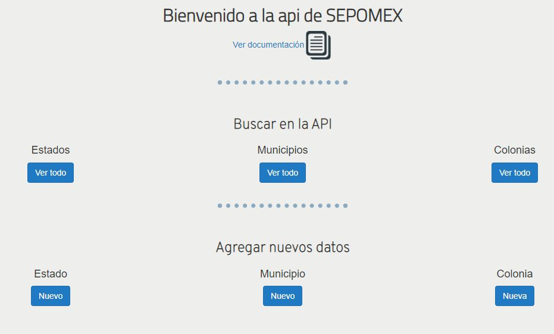
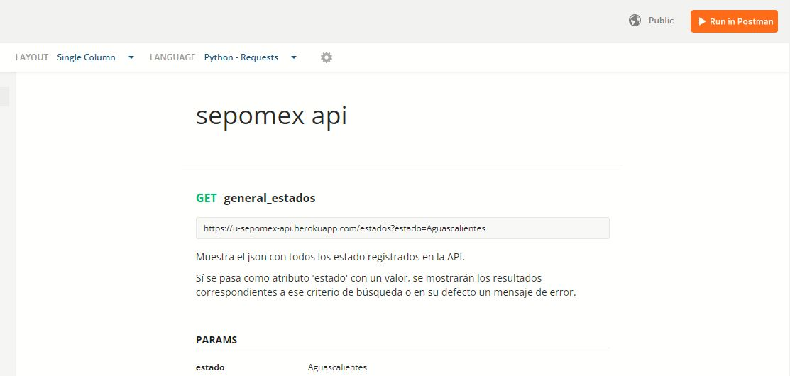
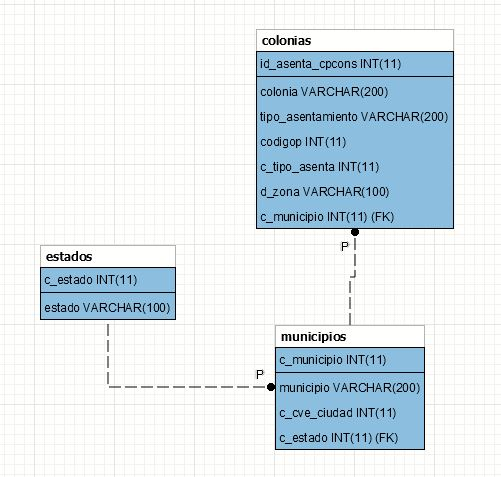

# Prueba desarrollador back-end jr

La API se encuentra alojada en un servidor gratuito como lo es heroku.
URL de la API: https://u-sepomex-api.herokuapp.com/

---

Así luce el sitio de la API

---

La documentación del funcionamiento de la API fue realizado con Postman.
URL de la documentación de la API: https://documenter.getpostman.com/view/19268642/UyrEib5r

Así luce el sitio de documentación

---

El modelo entidad relación de la base de datos es así

---

Para correr el programa de manera local solo es necesario tener instaladas las bibliotecas que contiene el archivo requirements.txt, una vez verificado eso sólo se ejecuta el archivo app.py
